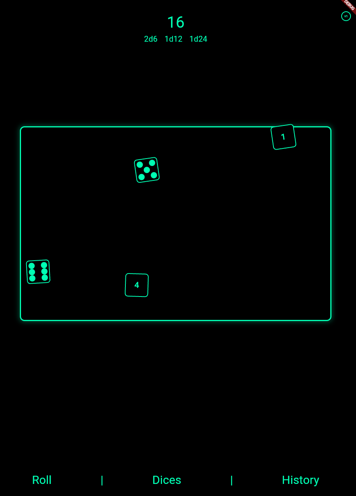

# 🎲 ReDice

A modern, physics-based dice rolling app built with Flutter. Roll dice with realistic animations, shake detection, and customizable themes.



## ✨ Features

- **🎯 Physics Simulation** - Dice bounce and collide realistically within the arena
- **📱 Shake to Roll** - Shake your device to roll all dice
- **🎨 Dual Themes** - Switch between modern and classic visual styles
- **🎲 Multiple Dice Types** - Support for d4, d6, d8, d10, d12, d16, d20, d24, d100
- **📊 Roll History** - Track your previous rolls with timestamps
- **⚡ Smooth Animations** - Fluid dice movement with rotation and collision detection

## 🎮 How to Use

1. **Add Dice** - Tap "Dices" to add/remove different dice types
2. **Roll** - Tap "Roll" or shake your device to roll all dice
3. **View History** - Tap "History" to see your previous rolls
4. **Switch Theme** - Tap the theme toggle (v0/v1) for different visual styles

## 🏗️ Architecture

```
lib/
├── app/
│   ├── controllers/     # Business logic & state management
│   ├── factories/       # Factory pattern for theme-based widgets
│   ├── models/          # Data models (Dice, themes, etc.)
│   ├── services/        # External services (storage, preferences)
│   ├── views/           # UI screens and modals
│   ├── widgets/         # Reusable UI components
│   └── utils/           # Constants and utilities
└── main.dart
```

## 🚀 Getting Started

```bash
flutter pub get
flutter run
```

## 🎯 Current Status

✅ Physics-based dice rolling  
✅ Shake detection  
✅ Multiple dice types  
✅ Theme switching  
✅ Roll history  
✅ Responsive design

🔄 **Work in Progress** - Adding more features and polish!

---

_Shake it 'til you make it_ 🎲✨
